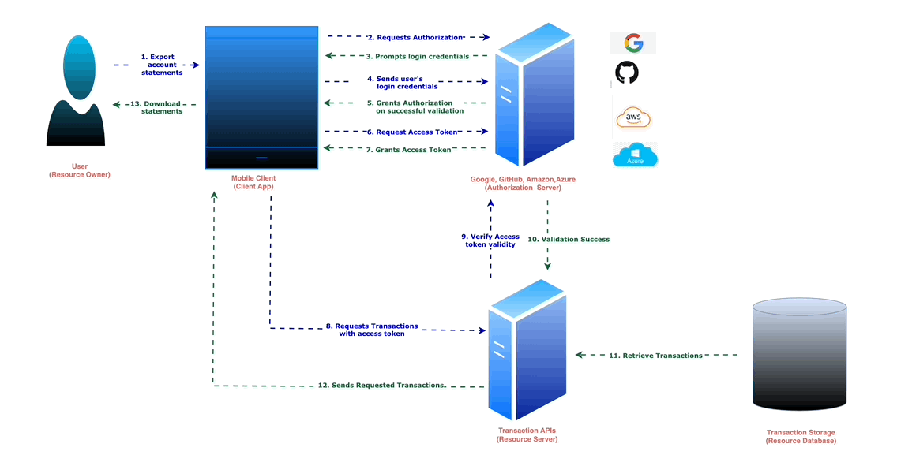

 # Introduction

What is OAuth 2.0?

The OAuth 2.0 Authorization Framework streamlines the sharing of private resources, such as data or services, with a third-party client application. 
Within an OAuth session, these private resources reside on a resource server, and the resource owner, typically a person but sometimes an application, grants the client application permission to access them.

## OAuth2 Login Made Easy in Java

Upon granting permission, the OAuth authorization server generates an access token for the client application. This access token serves as a credential that the client application presents to the resource server. The resource server, in turn, verifies the token's validity by communicating with the authorization server. If the token is valid, the resource server grants access to the requested resources.

Illustratively, consider the roles involved in an OAuth session. In this scenario, User, as the resource owner, seeks to export account statements stored on the TransactionStorage website (acting as the resource server) through the Mobile app service (the client application). 
To facilitate this, Mobile app provides User with an application running on his device. User initiates the process using this application, which prompts Mobile app to send a request to the TransactionStorage authorization server. Following this, the authorization server seeks authorization from User and issues a token to Mobile app, enabling it to access User's transactions on Transaction Storage.

## Design Architecture

